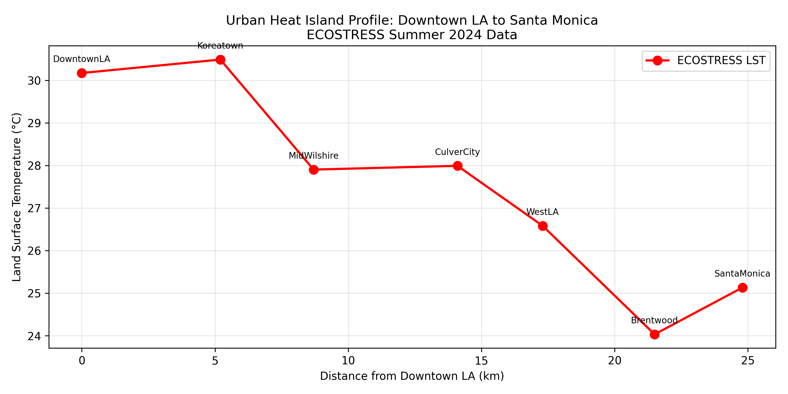
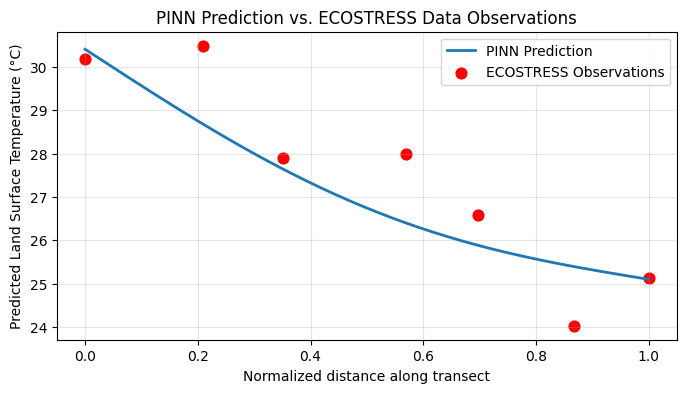
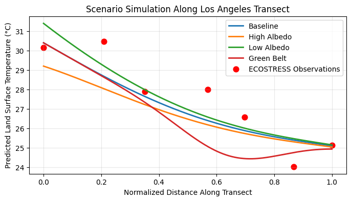

# Los Angeles Urban Heat Island PINN

## Abstract
Urban heat islands (UHIs) are urban regions that experience higher temperatures than surrounding areas due to the replacement of natural surfaces with buildings and pavement. This project investigates the use of Physics-Informed Neural Networks (PINNs) to model urban heat island temperature patterns in Los Angeles. Using DeepXDE and TensorFlow, the model incorporates physical constraints to improve prediction accuracy and provide insight into spatial temperature distributions. The results demonstrate the potential of PINNs as a tool for understanding and predicting urban heat island effects.

## Tools Used
- Google Colab
- DeepXDE
- TensorFlow
- NumPy
- Matplotlib
- SciPy

## Key Figures
### Figure 1. ECOSTRESS Temperature Transect


Mean summer 2024 land surface temperature data from Downtown Los Angeles to Santa Monica derived from NASA ECOSTRESS observations.

### Figure 4. PINN Temperature Prediction


Comparison of the PINN prediction with the observed ECOSTRESS temperature data along the transect.

### Figure 5. Urban Heat Mitigation Scenarios


Predicted temperature profiles under high-albedo, low-albedo, and green-belt scenarios.

## Repository Structure

```text
urban_heat_island_pinn/
├── data/
│   └── LA-ECO-L2-LSTE-002-results.csv
├── images/
│   ├── figure1_ecostress_transect.png
│   ├── figure2_pinn_architecture.png
│   ├── figure3_loss_curve.png
│   ├── figure4_uhi_prediction.png
│   ├── figure5_scenario_simulation.png
│   ├── figure6_validation_scatter.png
│   └── figure7_hidden_validation.png
├── notebooks/
│   └── 1D DeepXDE PINN.ipynb
├── paper/
│   └── Physics-Informed Neural Networks for Urban Heat Islands.pdf
├── README.md
├── LICENSE
└── .gitignore
```

## How to Run

1. Open `notebooks/1D DeepXDE PINN.ipynb` in Google Colab.
2. Change the runtime type to **T4 GPU** for faster model training (`Runtime` → `Change runtime type` → `T4 GPU` → `Save`)
3. Run all cells sequentially.
4. The notebook will load in the ECOSTRESS dataset from the `data/` folder and generate all the figures used in the study.
